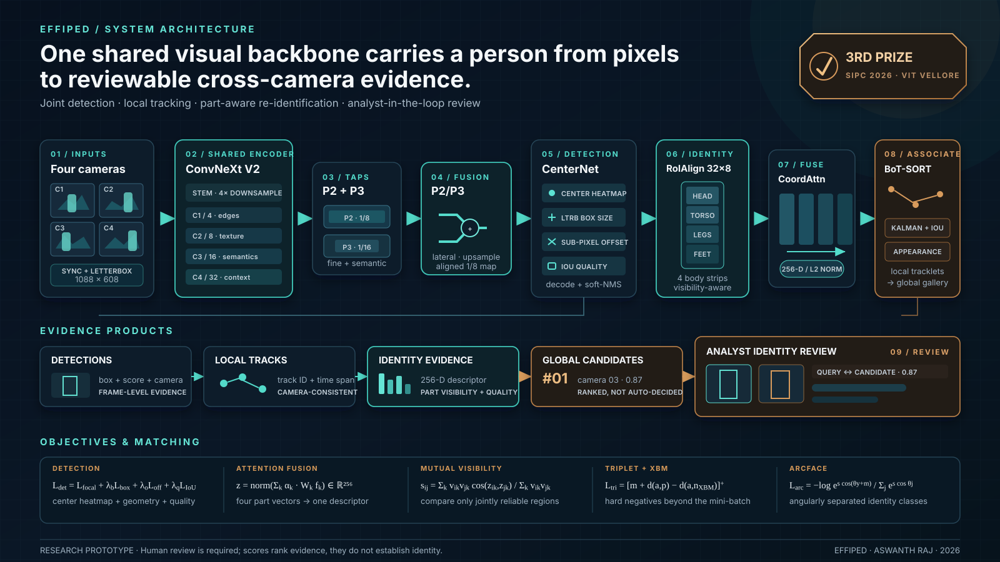

<div align="center">
  

  # EffiPed

  ## Multi-Camera Pedestrian Detection, Tracking & Re-Identification using Joint ConvNeXt V2 Architecture

  By [Aswanth Raj](https://github.com/aswanth-07)

  [](https://github.com/aswanth-07/effiped-multi-camera-tracking/actions/workflows/ci.yml)
  [](LICENSE)
  [](docs/media/LICENSE.md)
</div>

EffiPed is a compact video-intelligence system that detects pedestrians, maintains
camera-local tracks, and ranks cross-camera identity candidates for human review. Its
React investigation console is available as a precomputed browser demo; the same workflow
can connect to local FastAPI/CUDA inference when an authorized checkpoint is available.

> [!IMPORTANT]
> Ranked matches are reviewable appearance evidence, not proof of identity. The hosted
> experience is a precomputed, non-commercial research demonstration. Public model weights
> remain withheld while training-data redistribution terms are unresolved.

## Try the identity-review demo

The hosted UI restores the original PedestrianTracker workflow:

- a synchronized four-camera replay with tracker-rendered boxes;
- indexed query crops and ranked cross-camera candidates;
- camera scope, playback, frame stepping, and detection timelines;
- a second replay containing the archived cross-camera association output;
- responsive desktop and mobile review modes.

```bash
cd apps/web
npm install
npm run dev
```

No synthetic browser boxes are drawn over the footage. The boxes visible in the demo are
the annotations rendered by the original tracking pipeline.

## System

One ConvNeXt V2 feature hierarchy supports CenterNet-style detection and a 256-D
part-aware identity descriptor. RoIAlign extracts a person feature map, four horizontal
body strips retain local appearance, and Coordinate Attention fuses the visible evidence.
BoT-SORT combines motion, overlap, and appearance for local temporal association; the
gallery then ranks possible cross-camera matches for an analyst.

| Evaluation | Result |
|---|---:|
| P-DESTRE validation cross-camera Rank-1 | **62.8%** |
| P-DESTRE test cross-camera Rank-1 | **61.3%** |
| P-DESTRE validation / test detection mAP@0.5 | **90.74% / 88.4%** |
| MOT17 val-half MOTA / IDF1 / HOTA | **64.08 / 74.24 / 61.34** |
| EffiPed Tier-1 footprint | **7.78M · ≈18 full-pipeline FPS** |

Each value has a protocol label in [RESULTS.md](RESULTS.md). The interactive replay is an
application demonstration, not a benchmark run.

## Architecture

[](docs/architecture/effiped-architecture.svg)

The diagram is also available as an
[editable PowerPoint](docs/architecture/effiped-architecture.pptx).

## Repository map

```text
src/effiped/          installable model, descriptors, tracking, runtime
apps/api/             FastAPI local-GPU service and job lifecycle
apps/web/             React/Vite identity-review UI and hosted replay
configs/system/       active EffiPed and matched PartJDE configurations
research/results/     single source of truth for published evidence
research/report/      generated technical report
docs/architecture/    editable diagram source and web exports
docs/media/           optimized, attributed demonstration media
tools/ and tests/     validation, regression, and release checks
```

## Run live inference locally

Python 3.11 and an NVIDIA GPU are recommended.

```bash
python -m venv .venv
# Windows: .venv\Scripts\activate
# Linux/macOS: source .venv/bin/activate
pip install -e ".[runtime]"
effiped-app
```

Place an authorized checkpoint in `EFFIPED_WEIGHTS_DIR`. When none is present, the API
reports the model as unavailable without exposing a local filesystem path.

```bash
effiped-train --config configs/system/effiped-tier1.yaml
effiped-eval --config configs/system/effiped-tier1.yaml
effiped-demo
```

| Variable | Purpose |
|---|---|
| `EFFIPED_WEIGHTS_DIR` | authorized local model artifacts |
| `EFFIPED_RUNTIME_DIR` | temporary uploads, crops, and job assets |
| `EFFIPED_DEVICE` | `auto`, `cpu`, `cuda`, or `cuda:N` |
| `EFFIPED_MAX_UPLOAD_MB` | per-video upload limit |
| `EFFIPED_ALLOWED_ORIGINS` | comma-separated CORS allowlist |

## Public API

- `GET /api/health`
- `GET /api/models`
- `POST /api/person-search/jobs`
- `GET /api/person-search/jobs/{job_id}` and `/stream`
- `GET .../people`, `/detections`, `/tracks`, and `/matches`
- `POST .../search-by-example`
- `DELETE /api/person-search/jobs/{job_id}`
- `GET /api/assets/{asset_id}`

Deleting a job removes uploaded video and generated assets.

## Research connections

The later [BoxJDE Person Search](https://github.com/aswanth-07/boxjde-person-search)
repository isolates the full-person descriptor readout and documents its five-fold
P-DESTRE ablation. It is linked as related research; its code and report are not duplicated
here.

## Licensing and responsible use

Original software is © 2026 Aswanth Raj and licensed under Apache-2.0. P-DESTRE-derived
media under `docs/media/pdestre/` is separately licensed as a CC BY-NC-SA 4.0 adaptation
for this non-commercial showcase. The
[asset manifest](docs/media/ASSET_MANIFEST.json) records the source, transformations,
hash, purpose, and license for every derived asset.

No dataset, source video, person-level benchmark record, checkpoint, or runtime crop is
included.

[Model card](MODEL_CARD.md) ·
[Data and weight-release audit](DATA_LICENSES.md) ·
[Third-party notices](THIRD_PARTY_NOTICES.md) ·
[P-DESTRE paper](https://arxiv.org/abs/2004.02782) ·
[CC BY-NC-SA 4.0](https://creativecommons.org/licenses/by-nc-sa/4.0/)
