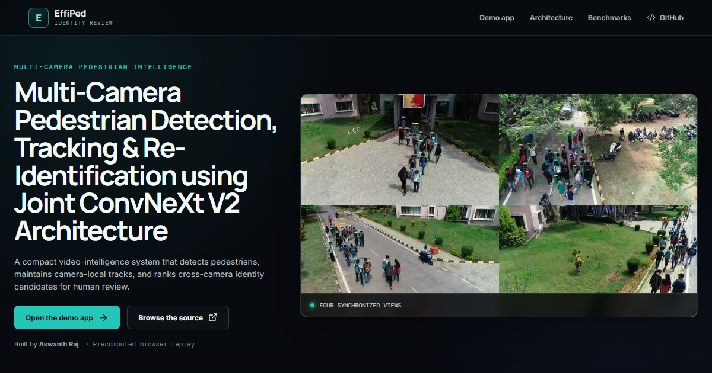

<div align="center">
  

  # EffiPed

  ## Multi-Camera Pedestrian Detection, Tracking & Re-Identification using Joint ConvNeXt V2 Architecture

  **3rd Prize — Student Innovation Project Contest 2026**  
  Vertical 1: AI & Intelligent Systems · VIT Vellore SCOPE

  By [Aswanth Raj](https://github.com/aswanth-07) · Guide: Sri Preethaa KR

  [](https://github.com/aswanth-07/effiped-multi-camera-tracking/actions/workflows/ci.yml)
  [](LICENSE)
  [](docs/media/LICENSE.md)
</div>

> [!IMPORTANT]
> The hosted experience is a precomputed, non-commercial research demonstration. It ranks
> appearance evidence for human review; it does not prove identity. Public model weights are
> withheld while training-data redistribution terms remain unresolved.

## The contest system

EffiPed shares one compact ConvNeXt V2 feature hierarchy across three connected tasks:
CenterNet-style pedestrian detection, BoT-SORT temporal association, and 256-D part-based
descriptors for cross-camera candidate retrieval. RoIAlign divides each person into four
body strips, CoordinateAttention weights visible evidence, and the analyst UI exposes the
result as reviewable candidates rather than an automated identity verdict.

| Verified contest evidence | Result |
|---|---:|
| P-DESTRE validation cross-camera Rank-1 | **62.8%** |
| P-DESTRE test cross-camera Rank-1 | **61.3%** |
| P-DESTRE validation / test detection mAP@0.5 | **90.74% / 88.4%** |
| MOT17 val-half MOTA / IDF1 / HOTA | **64.08 / 74.24 / 61.34** |
| Canonical Tier-1 footprint | **7.78M · ≈18 full-pipeline FPS** |

The submitted poster is preserved as an archived contest artifact with its original
`7.92M / 22 FPS / 62.8%` snapshot. The later canonical registry associates Tier-1 with
`7.78M` parameters and approximately `18 FPS` for the full pipeline. The poster’s
`+16.2 pp` row combined multiple configuration changes and is not presented as a pure
part-only ablation. See [RESULTS.md](RESULTS.md).

## From contest prototype to research

```text
EffiPed contest system
  joint detection + four-strip descriptor + multi-camera review
      │
      ├── PartJDE matched readout study: +6.66 pp validation Rank-1
      │
      └── BoxJDE five-fold readout study:
          +13.64/+12.94 pp source-level Rank-1/mAP
          +13.31/+12.29 pp natural predicted-box
          +13.01/+12.00 pp natural end-to-end
```

BoxJDE uses a constructed P-DESTRE per-date ablation, not official Task 4. Its complete
code, evidence, and technical report live in the
[BoxJDE Person Search repository](https://github.com/aswanth-07/boxjde-person-search).

## Repository map

```text
src/effiped/          installable model, descriptor, tracker, runtime
apps/api/             FastAPI local-GPU service and job lifecycle
apps/web/             React/Vite portfolio + identity-review UI
configs/contest/      contest and matched PartJDE configurations
research/results/     the single evidence fixture
research/report/      generated technical report
docs/architecture/    editable PowerPoint + site exports
docs/media/           optimized attributed demonstration media
tools/ and tests/     release validation and regression tests
```

## Explore the Vercel-safe demo

```bash
cd apps/web
npm install
npm run dev
```

The demo supports camera switching, clickable tracks, query selection, confidence-grouped
cross-camera candidates, timeline navigation, and evidence details without uploading video.

## Run live inference locally

Python 3.11 and an NVIDIA GPU are recommended.

```bash
python -m venv .venv
# Windows: .venv\Scripts\activate
# Linux/macOS: source .venv/bin/activate
pip install -e ".[runtime]"
effiped-app
```

Place an authorized checkpoint in `EFFIPED_WEIGHTS_DIR`; the API reports unavailable
weights cleanly when none is present.

Containerized local runtime:

```bash
docker build -t effiped .
docker run --gpus all --rm -p 127.0.0.1:8000:8000 \
  -v /authorized/weights:/weights:ro -v effiped-runtime:/runtime effiped
```

The loopback-only host mapping keeps the review surface local while the container listens on
its internal interface.

| Variable | Purpose |
|---|---|
| `EFFIPED_WEIGHTS_DIR` | authorized local model artifacts |
| `EFFIPED_RUNTIME_DIR` | temporary uploads, crops, and job assets |
| `EFFIPED_DEVICE` | `auto`, `cpu`, `cuda`, or `cuda:N` |
| `EFFIPED_MAX_UPLOAD_MB` | per-video upload limit |
| `EFFIPED_ALLOWED_ORIGINS` | comma-separated CORS allowlist |

Commands:

```bash
effiped-train --config configs/contest/effiped-tier1.yaml
effiped-eval --config configs/contest/effiped-tier1.yaml
effiped-demo
```

## Public API

- `GET /api/health`
- `GET /api/models`
- `POST /api/person-search/jobs`
- `GET /api/person-search/jobs/{job_id}` and `/stream`
- `GET .../people`, `/detections`, `/tracks`, and `/matches`
- `POST .../search-by-example`
- `DELETE /api/person-search/jobs/{job_id}`
- `GET /api/assets/{asset_id}`

Deleting a job removes uploaded video and all generated assets. Model metadata is portable
and never exposes workstation paths.

## Reports, architecture, and responsible use

- [Editable architecture PowerPoint](docs/architecture/effiped-architecture.pptx)
- [Technical report](docs/report/effiped-technical-report.pdf)
- [Model card](MODEL_CARD.md)
- [Award record](AWARD.md)
- [Data and weight-release audit](DATA_LICENSES.md)
- [Third-party notices](THIRD_PARTY_NOTICES.md)

Software is © 2026 Aswanth Raj and licensed under Apache-2.0. P-DESTRE-derived media under
`docs/media/pdestre/` is a separate CC BY-NC-SA 4.0 adaptation for this non-commercial
showcase. Its [asset manifest](docs/media/ASSET_MANIFEST.json) records transformations and
hashes. No source videos, datasets, person-level benchmark records, or checkpoints are included.

[P-DESTRE paper](https://arxiv.org/abs/2004.02782) ·
[CC BY-NC-SA 4.0](https://creativecommons.org/licenses/by-nc-sa/4.0/)
